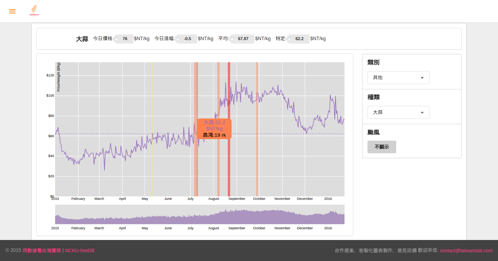
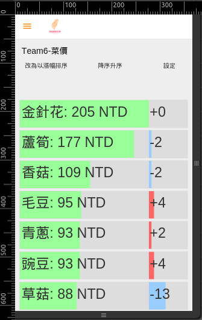
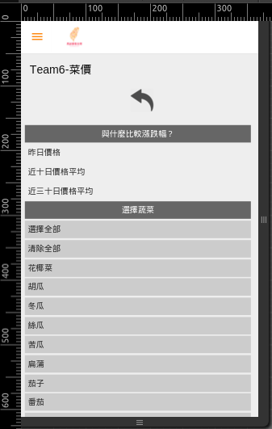

# 菜價

## UI

重新整理頁面時，若寬度夠，呈現桌機版；不夠，呈現手機版。

### 桌機版

#### 選項
* 類別
* 種類
* 是否顯示颱風資訊
* Brush可選取折現圖要放大的部份

#### 資訊
* 今日菜價、漲幅
* 平均(2015-1-1至今)
* 游標指定日期的價格
* 2015-1-1至今的折現圖

### 手機版

#### 選項
* 所有種類、多重選擇、重置、全選
* 單一天、十天平均、三十天平均的價格與漲幅
* 價格與漲幅顯示的排序

#### 資訊
* 今日菜價、漲幅
* 近十天、近三十天的平均菜價與漲幅
